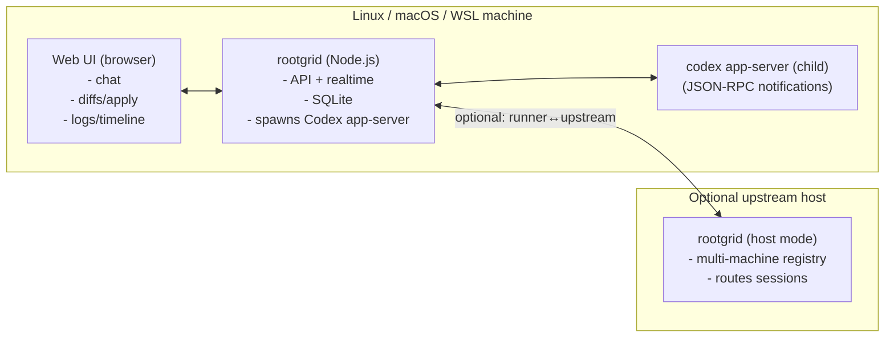

# Rootgrid

Rootgrid is a **local-first**, **web-UI-first** agent runner that drives **OpenAI Codex via `codex app-server`**.

Key constraints for v0:
- **One** npm package + **one** command: `rootgrid`
- Implemented in **Node.js**, **JavaScript**, **ESM-only**
- **No terminal/CLI UX for agent sessions** — all interaction happens in the **web UI**
- Runs on **Linux**, **macOS**, and **WSL** (no native Windows support yet)

> Status: early scaffold (backend skeleton + design docs). Not feature-complete yet.

---

## Quick start (planned)

```bash
# 1) interactive setup wizard
npx rootgrid setup

# 2) start the service (host or runner mode, based on config)
npx rootgrid
```

Configuration is written to:

- `~/.rootgrid/config.json`

---

## CLI commands (v0)

- `rootgrid setup`: interactive wizard (prereqs, optional installs, autostart, runner + host/upstream config). See `docs/setup.md`.

---

## Web UI (planned)

- Built with **Vue (JavaScript-only)** + **Vite**
- Packaged as a **PWA** (mirrors HAPI’s approach; built assets ship inside the npm package)
- UX toolkit: **shadcn-vue** (Tailwind-based component set)

---

## Architecture at a glance



Full design details live in:
- `docs/architecture.md`
- `docs/protocol.md`
- `docs/setup.md`
- `docs/integrations/codex.md`
- `docs/kickoff.md`

Design history lives in `DesignDecisions.md`.

Protocol summary (v0):
- browser ↔ host: **REST + SSE**
- runner ↔ host: **WebSocket**
- VS Code viewer: **HTTP + WebSocket** proxied/tunneled through the host
