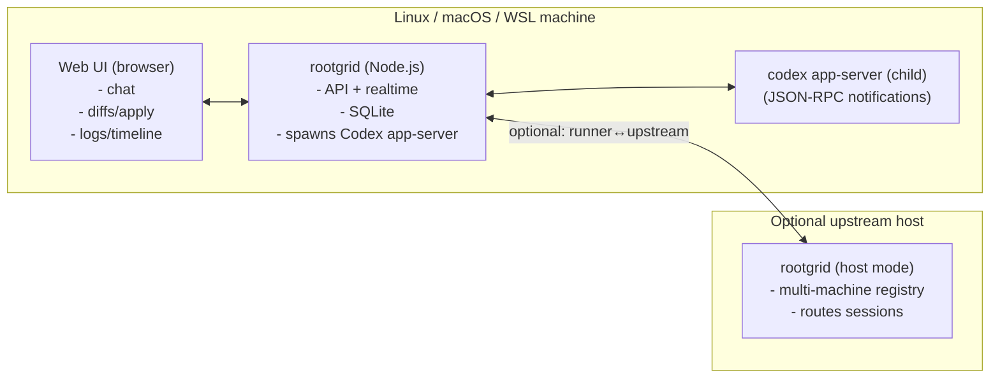

# Rootgrid

Rootgrid is a **local-first**, **web-UI-first** agent runner that drives **OpenAI Codex via `codex app-server`**.

Key constraints for v0:
- **One** npm package + **one** command: `rootgrid`
- Implemented in **Node.js**, **JavaScript**, **ESM-only**
- **No terminal/CLI UX for agent sessions** — all interaction happens in the **web UI**
- Runs on **Linux**, **macOS**, and **WSL** (no native Windows support yet)

> Status: v0 in progress. Core loop (host+runner, sessions, approvals, VS Code web tunneling) is implemented but still hardening.

---

## Quick start

```bash
# 1) interactive setup wizard
npx rootgrid setup

# 2) start the service (host or runner mode, based on config)
npx rootgrid
```

Git-based private install also works:

```bash
git clone <repo-url>
cd rootgrid
npm ci
npm run build
node src/cli.js setup
node src/cli.js
```

For later local updates without rerunning setup:

```bash
rootgrid update-local     # refresh ~/.rootgrid/current from the current package and restart autostart if enabled
rootgrid install-service  # install/start the user service again
rootgrid remove-service   # stop/remove the user service
```

Then:
- Open the printed URL (default `http://127.0.0.1:7337/`)
- Paste the **client token** from `~/.rootgrid/config.json` into the login screen
- (Optional) Install `code-server` on the runner machine to enable the **VS Code** button in the UI.
- The web terminal uses the system `script` command (normally present on Linux/macOS), so no native Node PTY addon is required.

Configuration is written to:

- `~/.rootgrid/config.json`
- `config.example.json` – example config covering every current field

Setup also installs a managed runtime under:

- `~/.rootgrid/releases/<release-id>/`
- `~/.rootgrid/current -> ~/.rootgrid/releases/<release-id>/`

That managed runtime is used for **runner-only installs** and remote runner upgrades. Host-mode installs run directly from the current package checkout/install so a normal `git pull` + restart picks up the new UI/code.

---

## MVP runbook (v0)

1) Run setup: `npx rootgrid setup`  
2) Start Rootgrid: `npx rootgrid`  
3) Open the UI and authenticate with `host.auth.clientToken`  
4) Click **Settings → Defaults** and set your workspace (`cwd`)  
5) Type a message to start a new session (first message creates the session)  
6) When an **approval** modal appears, accept/decline as needed  
7) (Optional) Click **VS Code** to open the VS Code web viewer (requires `code-server` on the runner)

## Reverse proxy (TLS termination)

If you run Rootgrid behind a reverse proxy:
- set `host.trustProxy=true` in `~/.rootgrid/config.json`
- configure your proxy for **SSE** (`/api/events`) and **WebSockets** (`/v1/*`, `/vscode/*`)

See: `docs/reverse-proxy.md`.

## Troubleshooting

- **“Unauthorized” in UI**: use `host.auth.clientToken` from `~/.rootgrid/config.json` (then reload)
- **“no runner connected”**: ensure `runner.enabled=true` and Rootgrid is running on the runner machine
- **Codex not found**: install the Codex CLI (`codex`) and re-run `rootgrid`
- **Need raw Codex traffic for debugging**: set `debug.codexRawCapture.enabled=true` in `~/.rootgrid/config.json`; captures land in `~/.rootgrid/debug/codex/` by default
- **Want web-triggered runner upgrades on version mismatch**: it is enabled by default for managed installs; the host now ships a prebuilt release bundle to the runner and the runner restarts via its user service
- **SSE stuck behind proxy**: disable proxy buffering for `/api/events`
- **VS Code button fails**: install `code-server` on the runner; ensure the runner tunnel (`/v1/tunnel`) is connected

---

## CLI commands (v0)

- `rootgrid setup`: interactive wizard (prereqs, optional installs, autostart, runner + host/upstream config). See `docs/setup.md`.
- `rootgrid update-local`: install the current package into the managed runtime and refresh the user service if autostart is enabled.
- `rootgrid install-service`: install/start the user service (`systemd --user` on Linux/WSL, `launchd` on macOS).
- `rootgrid remove-service`: stop/remove the user service and disable autostart in `~/.rootgrid/config.json`.

## Dev checks

- `npm test`
- `npm run build`

---

## Web UI (planned)

- Built with **Vue (JavaScript-only)** + **Vite**
- Packaged as a **PWA** (built assets ship inside the npm package)
- UX toolkit: **shadcn-vue** (Tailwind-based component set)

---

## Architecture at a glance



Full design details live in:
- `docs/architecture.md`
- `docs/protocol.md`
- `docs/setup.md`
- `docs/integrations/codex.md`
- `docs/kickoff.md`

Design history lives in `DesignDecisions.md`.

Protocol summary (v0):
- browser ↔ host: **REST + SSE**
- runner ↔ host: **WebSocket**
- VS Code viewer: **HTTP + WebSocket** proxied/tunneled through the host
