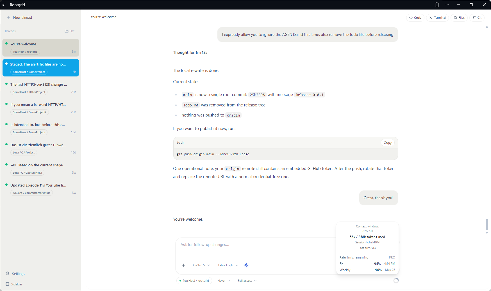
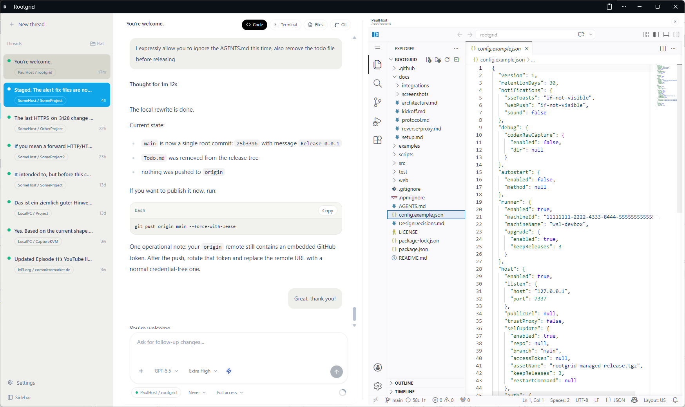
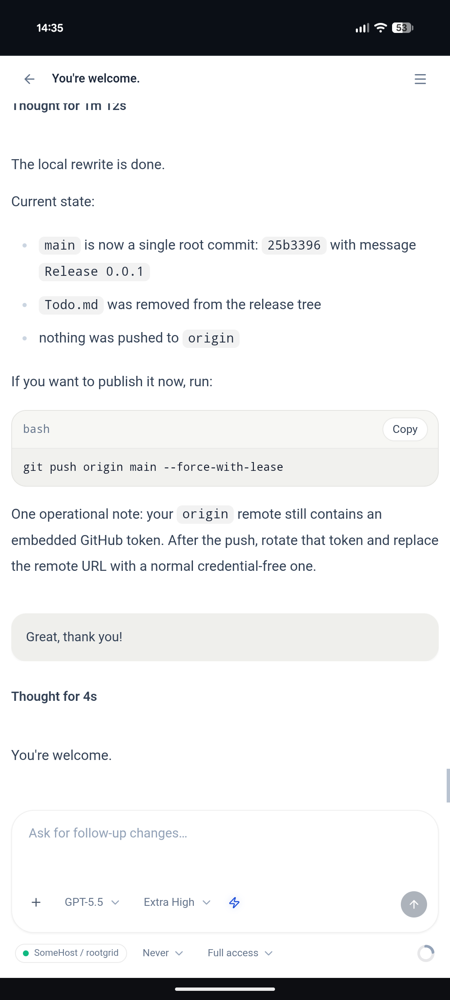
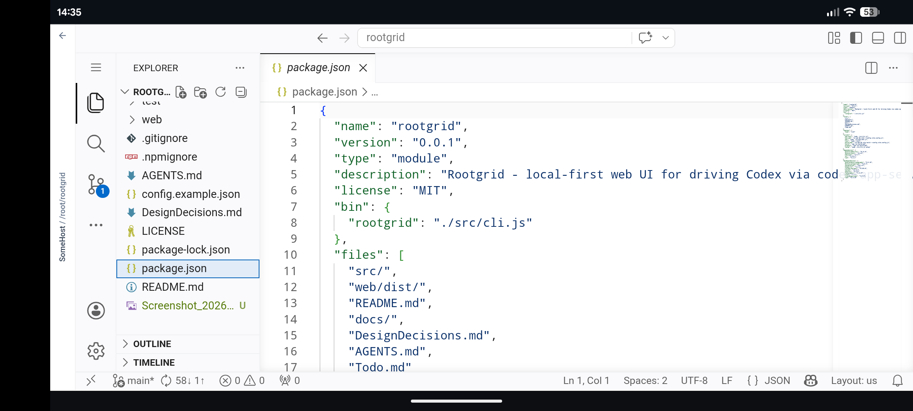
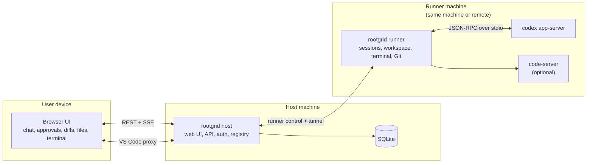

# Rootgrid [](https://github.com/openai/codex)

Rootgrid is a local-first browser UI for running OpenAI Codex through `codex app-server`.
It gives you a persistent control plane for sessions, approvals, diffs, files, terminals,
Git, and optional `code-server`, while keeping execution on your own machines.

> Status: usable v0, still hardening. The host, runner, approvals, remote runners, tunneled
> VS Code, and managed tool installs are implemented.

## What Rootgrid Is

- Browser-first: agent sessions live in the web UI, not in a separate terminal client.
- Local-first: the host keeps state in local SQLite on infrastructure you control.
- Simple packaging: one npm package and one command, `rootgrid`.
- Flexible deployment: run host and runner on one machine, or keep the host separate and attach remote runners.
- Codex-native: approvals and sandbox policy stay Codex-managed.

## Screenshots

<p align="center">
  
  
</p>

<p align="center">
  
  
</p>

## Quick Start

### From a source checkout

```bash
git clone <repo-url>
cd rootgrid
npm ci
npm run build
node src/cli.js setup
node src/cli.js
```

### From the npm package

```bash
npx rootgrid setup
npx rootgrid
```

After startup:

1. Open `http://127.0.0.1:7337/`.
2. Log in with `host.auth.clientToken` from `~/.rootgrid/config.json`.
3. Set a default workspace in **Settings**.
4. Start a thread from the chat UI.

## High-Level Architecture



- In the default setup, the host and runner are on the same machine.
- Remote runners connect back to the host; the host does not need to SSH into them.
- `code-server` stays runner-local and is only exposed through the host.

See [docs/architecture.md](docs/architecture.md) and [docs/protocol.md](docs/protocol.md) for the full transport and storage split.

## Common Deployment Shapes

### Single machine

This is the default and simplest setup: one machine runs both host and runner, and the browser talks to the host over localhost.

### Host plus remote runners

Use **Settings → Machines** on the host to generate a short-lived install command for another machine:

```bash
curl -fsSL 'https://YOUR-HOST/api/install/runner.sh?installToken=...' | bash
```

The remote machine only needs `curl`, `node`, and `tar`.

### Managed host install from GitHub

Rootgrid can bootstrap and later self-update from GitHub-built branch bundles. See:

- [docs/setup.md](docs/setup.md)
- [examples/docker-compose.github-release.yml](examples/docker-compose.github-release.yml)
- [scripts/install-host-from-github.sh](scripts/install-host-from-github.sh)
- [scripts/start-host-from-github-release.sh](scripts/start-host-from-github-release.sh)

## Key Capabilities

- Long-lived chat sessions grouped by machine and working directory.
- Approval prompts and structured turn history from Codex.
- Browser panes for files, terminal, Git, and optional VS Code web.
- Managed runner-local installs of Codex and `code-server`.
- Managed host self-update and runner upgrade flows.
- Toast, sound, and web-push notifications.

## CLI Commands

- `rootgrid setup`: interactive configuration and optional managed tool installs.
- `rootgrid`: start the configured host and/or runner roles.
- `rootgrid update-local`: refresh `~/.rootgrid/current` from the current checkout/package.
- `rootgrid install-service`: install or refresh the user service.
- `rootgrid remove-service`: stop and remove the user service.

## Development

```bash
npm test
npm run build
```

For local UI and runtime development:

```bash
npm run dev
```

`npm run dev` uses `~/.rootgrid-dev/` by default so it does not touch your real `~/.rootgrid/`.

## Docs

- [docs/setup.md](docs/setup.md): setup, autostart, managed installs, host self-update, remote runners
- [docs/architecture.md](docs/architecture.md): roles, topology, storage split
- [docs/protocol.md](docs/protocol.md): REST, SSE, WebSocket, and tunnel surfaces
- [docs/integrations/codex.md](docs/integrations/codex.md): Codex `app-server` integration details
- [docs/reverse-proxy.md](docs/reverse-proxy.md): proxying, TLS termination, SSE and WebSocket requirements
- [DesignDecisions.md](DesignDecisions.md): dated product and implementation decisions

## Operational Notes

- Rootgrid is focused on Linux and WSL. macOS should run, but it is not the main target.
- There is no Windows-native install path yet.
- The VS Code viewer requires `code-server` on the runner.
- Managed Codex install on Linux also attempts to install the system `bubblewrap` package.

## License

MIT. See [LICENSE](LICENSE).
