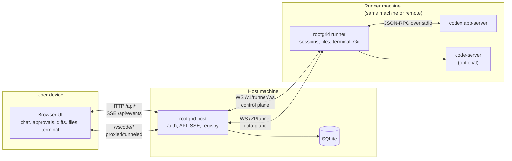

# Rootgrid Architecture

Rootgrid ships as one Node.js package and one command, `rootgrid`, but it can play two roles:

- **Host**: browser-facing control plane, durable store, session registry
- **Runner**: Codex execution plane on the same machine or a remote one

Current scope:

- **Codex only**, via `codex app-server`
- **Web UI only** for agent sessions
- **Linux + WSL** are the main targets
- **macOS** should run, but is not the primary focus

## Roles

### Host mode

The host is the control plane. It:

- serves the web UI and HTTP API
- owns auth, SSE, WebSocket endpoints, and the machine/session registry
- stores durable state in SQLite
- routes work to a local runner or remote runners

### Runner mode

The runner is the execution plane. It:

- spawns and supervises Codex sessions
- exposes workspace access, terminal access, and Git operations
- runs optional `code-server` for the VS Code web viewer
- streams normalized events back to the host

## Common Topologies

### Single-machine setup

This is the default v0 shape. One machine runs both host and runner, and the browser talks to the host over localhost.

### Host plus remote runners

The host stays central, but execution happens on separate runner machines. In that setup, runners initiate outbound connections back to the host.

## Topology

Notes:

- In the simplest setup, host and runner are the same local process boundary from the user’s perspective.
- When using remote runners, the runner connects outward to the host; you do not need the host to SSH into the runner.
- `code-server` remains runner-local and is only exposed through the host’s tunnel path.

## Transport Surface

### Browser ↔ host

- REST: `HTTP /api/*`
- Realtime updates: `GET /api/events` via SSE
- VS Code viewer: `HTTP + WebSocket /vscode/*`, proxied through the host

### Runner ↔ host

- Control plane: `WS /v1/runner/ws`
- Data plane / tunnel: `WS /v1/tunnel`

### Runner ↔ Codex

- `codex app-server` JSON-RPC, primarily over stdio

See [docs/protocol.md](protocol.md) for endpoint-level details and message shapes.

## Storage Split

### User configuration

- `~/.rootgrid/config.json`
- written and updated by `rootgrid setup`

### Host-side durable state

SQLite on the host is the system of record for:

- machines, sessions, approvals, and event history
- patch metadata and stored diffs
- IDE sessions
- runtime settings edited from the web UI
- push subscriptions
- upload metadata

Host-side uploaded files live under:

- `~/.rootgrid/uploads/<sessionId>/...`

### Runner-local state

Runners stay intentionally light. They keep only what is needed to execute reliably:

- managed tools under `~/.rootgrid/tools/`
- temporary or debug artifacts
- optional outbox spool state during disconnects
- runner-local upload copies for Codex image/file inputs

Codex uses the user’s normal `CODEX_HOME` by default so Codex settings and native session resume behavior still apply.

## Session Flow

1. The browser opens a session or starts a new one through the host.
2. The host assigns the target runner based on machine and working directory.
3. The runner starts or resumes a Codex `app-server` session.
4. Codex emits structured events, which the runner normalizes and sends back to the host.
5. The host persists and fans those events out to browsers over SSE.

## Security Model

Baseline assumptions for v0:

- Host binds to localhost by default.
- Browser/web UI access is protected by `host.auth.clientToken`.
- Runner registration uses a separate runner token.
- Reverse proxy deployments terminate TLS in front of the host.
- When `host.trustProxy=true`, the host respects forwarded proto/host headers from the proxy.

## Related Docs

- [docs/setup.md](setup.md)
- [docs/protocol.md](protocol.md)
- [docs/integrations/codex.md](integrations/codex.md)
- [docs/reverse-proxy.md](reverse-proxy.md)
