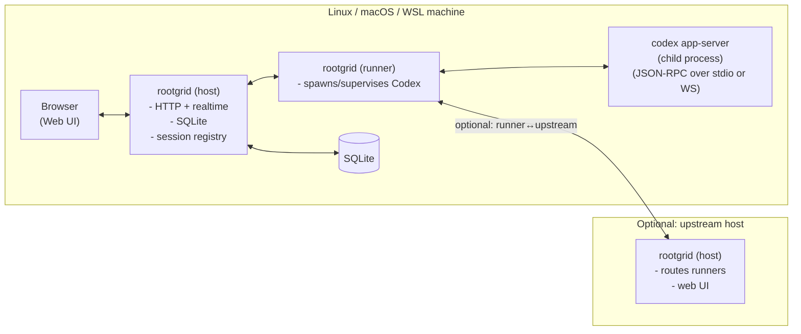

# Rootgrid architecture (v0)

Rootgrid is a **single** Node.js service + web UI, shipped as **one** npm package and **one** command: `rootgrid`.

v0 constraints:
- **Codex only**, via **`codex app-server`**
- **Web UI only** (no terminal/CLI UX for agent sessions)
- Host platforms: **Linux**, **macOS**, **WSL** (no native Windows support yet)

---

## Operating modes

Rootgrid supports two roles that can run together on one machine or separately:

1) **Host mode** (control plane)
- Serves the web UI and HTTP API.
- Maintains the durable store (SQLite).
- Routes commands to a local runner or to remote runners.

2) **Runner mode** (agent execution)
- Spawns and supervises Codex (`codex app-server`) sessions.
- Streams normalized events (output/status/patches) back to the host.

Default expectation for v0: **one machine runs both host+runner** (simple local-first setup). “Upstream host + remote runners” is supported via config.

---

## Architecture at a glance

Notes:
- In the simplest setup, **Host and Runner are the same process** (no network hop).
- When using an upstream host, the runner initiates an **outbound** connection to the host.

---

## Transports (v0)

- **Browser ↔ host (control plane)**:
  - REST: `HTTP /api/*`
  - Realtime: `GET /api/events` (SSE)
- **Runner ↔ host (control plane)**:
  - `WS /v1/runner/ws`
- **Runner ↔ host (tunnel / data plane)** (opened on-demand):
  - `WS /v1/tunnel`
  - Used to tunnel **HTTP + WebSocket** traffic for a runner-local VS Code web server.

See `docs/protocol.md`.

---

## Core concepts / domain model

- **Machine**: a registered runner (identified by `machineId`/`machineName`, plus last-seen and capabilities).
- **Project**: a workspace root directory on a machine (v0 can start with “sessions have a cwd” and add explicit projects later).
- **Session**: a long-running Codex thread/process binding (`sessionId`, `machineId`, cwd, status).
- **Run / Turn**: a unit of work within a session (prompt → streaming output → patch proposed).
- **Artifacts**: patches/diffs, logs, test outputs, summaries.

---

## Storage layout (v0)

User configuration:
- `~/.rootgrid/config.json` (written by `rootgrid setup`)

Host (durable):
- SQLite lives on the **host** and is the source of truth for:
  - machines, sessions, runs
  - normalized event log / message history
  - patch metadata + stored diffs
  - IDE sessions

Runner (ephemeral/minimal):
- Runner does **not** need SQLite.
- Runner keeps only what it needs to execute and survive brief disconnects:
  - Codex runs with the user’s normal `CODEX_HOME` by default (so Codex settings apply and native Codex can resume sessions)
  - small debug logs
  - optional on-disk “outbox spool” of events until the host confirms receipt

Retention:
- `config.retentionDays` (default `30`) applies to **everything** Rootgrid persists.
- Rootgrid should periodically delete session artifacts/logs and prune old session rows/records beyond `retentionDays`.

Exact schema and artifact layout should stay minimal in v0 and evolve based on the web UI needs.

---

## Codex integration (v0)

Rootgrid runs Codex via `codex app-server` and treats it as the “engine”:
- Create/resume threads via JSON-RPC (default: **stdio JSONL**; optional: **WebSocket transport**).
- Read streaming output as JSON-RPC **notifications** and map them into Rootgrid’s normalized event model.
- Extract patch/diff artifacts from structured events when available; otherwise request a unified diff artifact explicitly.
- Approvals/sandboxing are **Codex-managed**: Rootgrid sets the policy for the session and forwards any approval prompts to the web UI.

See `docs/integrations/codex.md`.

---

## Platform support

Supported:
- Linux (systemd integration for autostart when available)
- macOS (should run, but is not a focus for MVP; autostart is out of scope for v0)
- WSL (run Rootgrid inside the distro; Windows-native support comes later)

Not supported (v0):
- Windows-native installation/run (later: a Windows tray UI can manage a WSL-hosted Rootgrid)

---

## Security model (v0)

Baseline assumptions:
- Default host binding should be **localhost-only** (`127.0.0.1`) unless the user explicitly chooses otherwise.
- Host must use **separate access tokens**:
  - **client → host** (browser/web UI): `host.auth.clientToken`
  - **runner → host** (runner registration): `host.auth.runnerToken`
- Host mode must work behind a **reverse proxy** (TLS termination + WS upgrade), and should support
  `X-Forwarded-Proto` / `X-Forwarded-Host` when `host.trustProxy=true`.
- Runner→host connections use an **upstream URL + runner token** (`upstream.url` + `upstream.runnerToken`).

This is intentionally simple for v0; hardening (TLS termination, device auth, audit logs) can be layered later.
